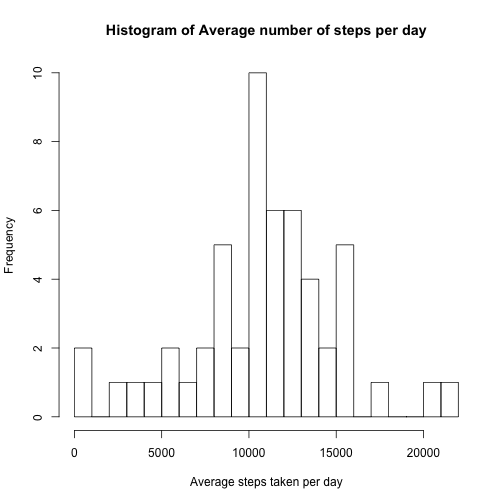
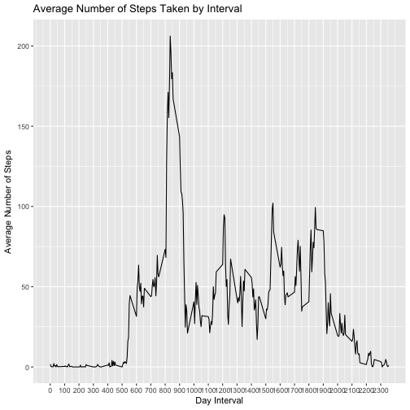
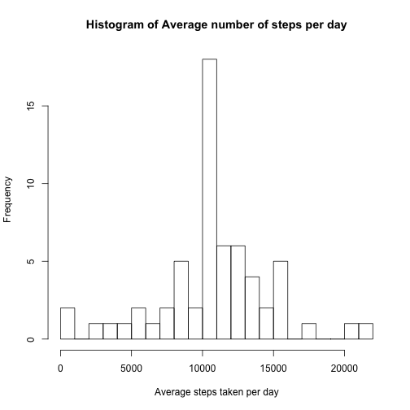
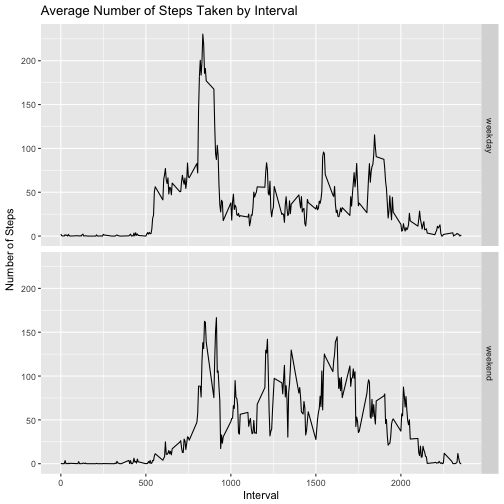

## Loading and preprocessing the data

Before loading the data the required libraries are called


```r
#Loading and preprocessing the data
library(dplyr)
library(ggplot2)
library(Hmisc)
```

Setting the working directory and loading the data

```r
setwd("/Users/sandeepkrishnamurthy/Documents/swetha/Learning/Data_Science/Reproducible_Products")
temp <- tempfile()
download.file("https://d396qusza40orc.cloudfront.net/repdata%2Fdata%2Factivity.zip",temp)
con <- unz(temp,"activity.csv")
Act_data <- read.table(con,header = TRUE,sep=",",na.strings = "NA",stringsAsFactors=FALSE)
unlink(temp)

Act_data$date <- as.Date(Act_data$date)

str(Act_data)
```

```
## 'data.frame':	17568 obs. of  3 variables:
##  $ steps   : int  NA NA NA NA NA NA NA NA NA NA ...
##  $ date    : Date, format: "2012-10-01" "2012-10-01" ...
##  $ interval: int  0 5 10 15 20 25 30 35 40 45 ...
```

```r
head(Act_data)
```

```
##   steps       date interval
## 1    NA 2012-10-01        0
## 2    NA 2012-10-01        5
## 3    NA 2012-10-01       10
## 4    NA 2012-10-01       15
## 5    NA 2012-10-01       20
## 6    NA 2012-10-01       25
```

## What is mean total number of steps taken per day?

Histogram of the total number of steps taken each day

```r
steps_per_day<-aggregate(steps~date,Act_data,sum,na.rm=TRUE)
hist(steps_per_day$steps,breaks = 20,main = "Histogram of Average number of steps per day",
     xlab="Average steps taken per day")
```



```r
mean_steps <- mean(steps_per_day$steps)
median_Steps <- median(steps_per_day$steps)
```


The mean is 10766 and median is 10765 of the total number of steps taken per day

## What is the average daily activity pattern?

A Time series plot of the 5-minute interval (x-axis) and the average number of steps taken, averaged across all days (y-axis) is created


```r
actInterval <- Act_data %>% group_by(interval) %>% summarise(meanSteps = mean(steps, na.rm = TRUE))

p2 <- ggplot(data = actInterval, mapping = aes(x = interval, y = meanSteps)) + geom_line() +
        scale_x_continuous("Day Interval", breaks = seq(min(actInterval$interval), 
                                                                      max(actInterval$interval), 100)) +
        scale_y_continuous("Average Number of Steps") + 
        ggtitle("Average Number of Steps Taken by Interval")
print(p2)
```



```r
max_Interval_meanSteps <- actInterval$interval[actInterval$meanSteps==max(actInterval$meanSteps)]
```

The average maximum number of steps across all the days is taken at 835th 5-minute interval

## Imputing missing values


```r
missing_values <- sum(is.na(Act_data$steps))
```

There are a 2304 of intervals where there are missing values (coded as NA). The presence of missing days may introduce bias into some calculations or summaries of the data.

Devise a strategy for filling in all of the missing values in the dataset.


```r
#group by data on interval variable
 Act_data_impute <- Act_data %>% group_by(interval) 

Act_data2 <- Act_data %>% left_join(actInterval, by = "interval")
# now, I'm going to create a new column replacing the missing data with the average

Act_data2$fillSteps <- ifelse(is.na(Act_data2$steps), Act_data2$meanSteps, Act_data2$steps)
Act_data3 <- Act_data2 %>% select(fillSteps,date,interval)
colnames(Act_data3)[1] <- "steps"
```

A new dataset that is equal to the original dataset but with the missing data filled in is created

```r
head(Act_data3)
```

```
##       steps       date interval
## 1 1.7169811 2012-10-01        0
## 2 0.3396226 2012-10-01        5
## 3 0.1320755 2012-10-01       10
## 4 0.1509434 2012-10-01       15
## 5 0.0754717 2012-10-01       20
## 6 2.0943396 2012-10-01       25
```

Histogram of the total number of steps taken each day

```r
steps_per_day2<-aggregate(steps~date,Act_data3,sum)
hist(steps_per_day2$steps,breaks = 20,main = "Histogram of Average number of steps per day",
     xlab="Average steps taken per day")
```



```r
mean_steps2 <- round(mean(steps_per_day2$steps),digits = 2)
median_Steps2 <- round(median(steps_per_day2$steps),digits = 2)
```

The mean is 10766 and median is 10766 of the total number of steps taken per day
Only the mean values differ from the estimates from beore imputing missing vales. The impact of imputing missing data on the estimates of the total daily number of steps is minimal. The Mean and Median is equal after filling up the missing values with mean values.

## Are there differences in activity patterns between weekdays and weekends?

 A new factor variable in the dataset with two levels – “weekday” and “weekend” indicating whether a given date is a weekday or weekend day is created
 

```r
Act_data4 <- Act_data3  %>% mutate(weekday=weekdays(date)) %>% mutate(weekvalue=ifelse(weekday %in% c("Saturday","Sunday"),"weekend","weekday"))
```
A panel plot containing a time series plot of the 5-minute interval (x-axis) and the average number of steps taken, averaged across all weekday days or weekend days (y-axis) is created.


```r
 actIntervalWk <- Act_data4 %>% group_by(interval,weekvalue) %>% summarise(meanSteps = mean(steps))

p4 <- ggplot(data = actIntervalWk, mapping = aes(x = interval, y = meanSteps)) + geom_line()+
        facet_grid(weekvalue~.) +
        scale_x_continuous("Interval") +
        scale_y_continuous("Number of Steps") +
        ggtitle("Average Number of Steps Taken by Interval")
print(p4)
```



From the above charts we can see the activity pattern on weekdays and weekends are different. The spikes of average steps taken is spread through the day on weekend.

